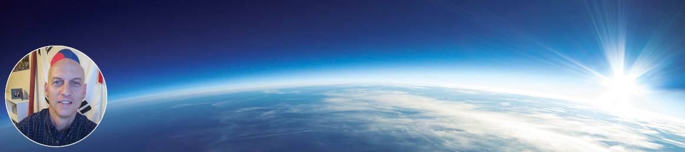

### G'day traveller.  Thanks for stopping by 👋

I'm slowly assembling a library of projects for Computer Science teachers to use with their high school students and/or beginning college students.  These are projects that have worked well in my classrooms over the last few years.  Of course, each project individually might be in a state of repair or upgrade.  If in doubt, ask me.

Everything here is free for your classroom use.  All I ask is that you contribute back to the library and when the opportunity arises, put in a kind word for what I'm trying to do.

What I do? 👨‍💻
* Computer Science Instructor
* Mathematics Instructor
* Free tutor to anyone who wants to learn

What if you like my work? 🤩
* You can Star ⭐ the repositories you like.
* You can click the follow button and tell other teachers
* You can contribute your own projects to this library

<!--
**ke5urh/ke5urh** is a ✨ _special_ ✨ repository because its `README.md` (this file) appears on your GitHub profile.

Here are some ideas to get you started:

- 🔭 I’m currently working on ...
- 🌱 I’m currently learning ...
- 👯 I’m looking to collaborate on ...
- 🤔 I’m looking for help with ...
- 💬 Ask me about ...
- 📫 How to reach me: ...
- 😄 Pronouns: ...
- ⚡ Fun fact: ...
-->
